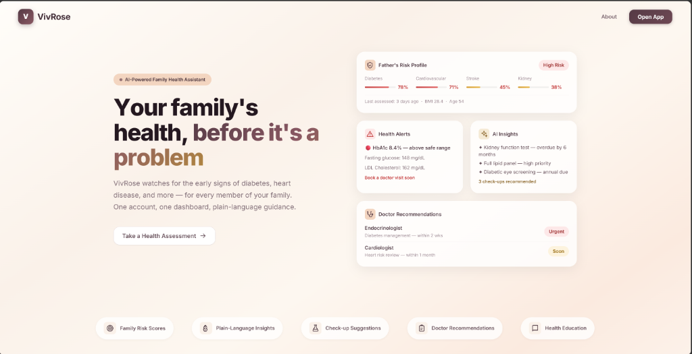
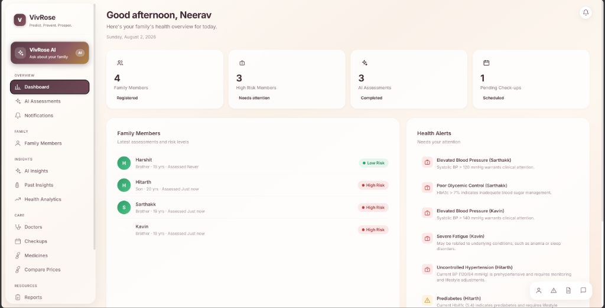
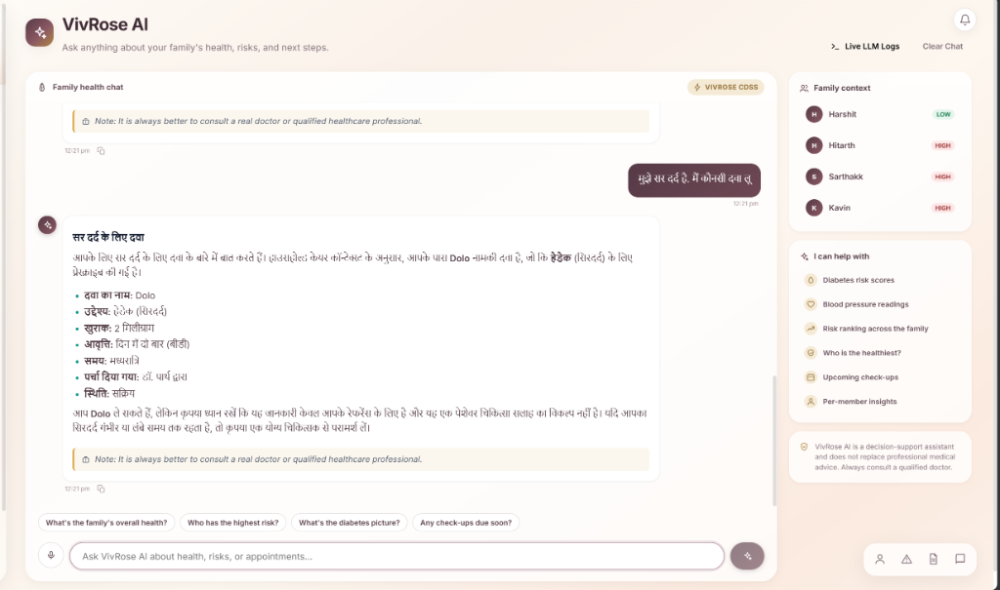
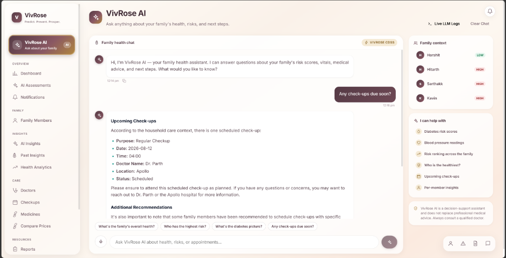
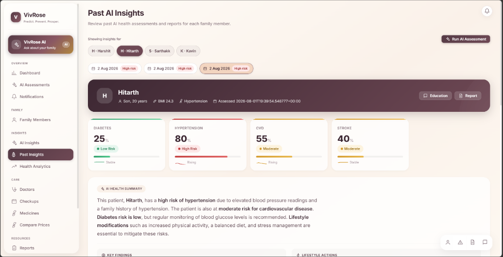
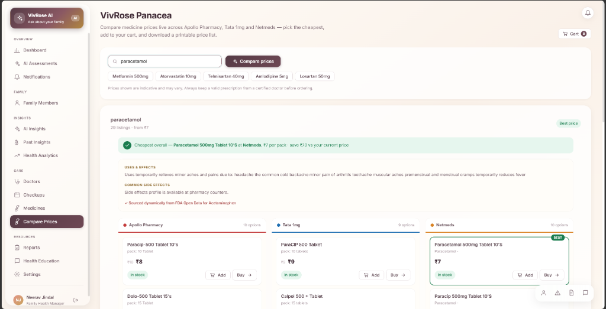
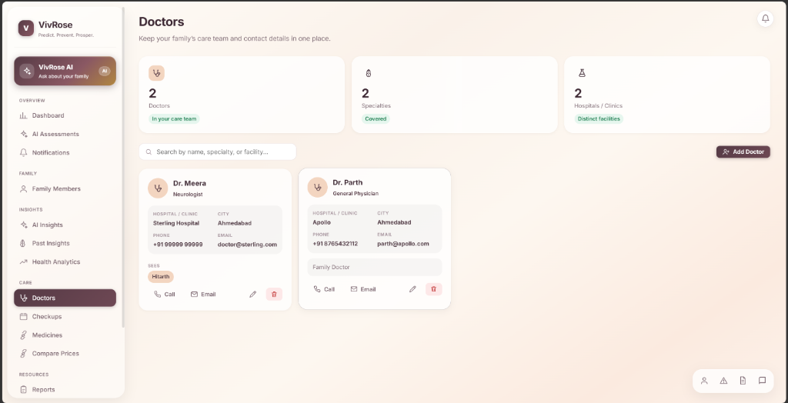
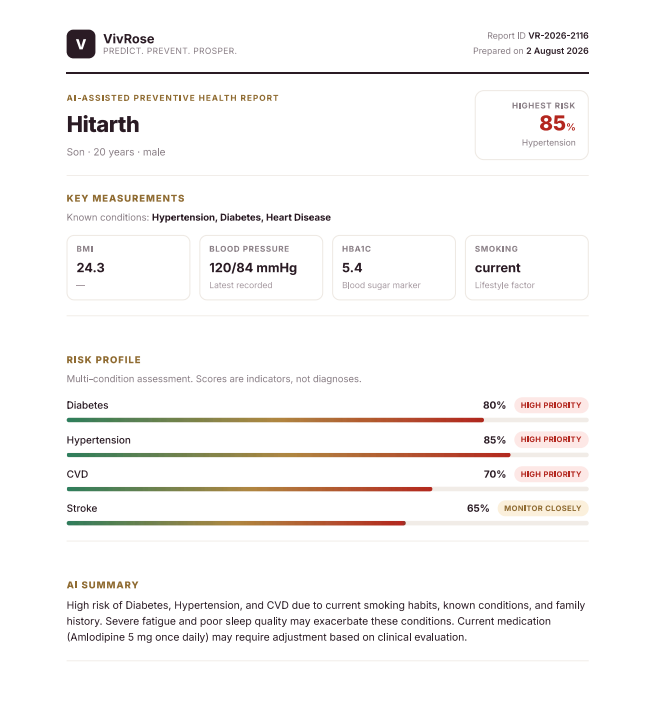

<div align="center">


### Predict. Prevent. Prosper.

**AI-powered preventive healthcare and clinical decision support for families.**

[](#license)
[](#tech-stack)
[](#tech-stack)
[](#tech-stack)
[](#tech-stack)

</div>

---

## About

VivRose is a full-stack clinical decision support platform that enables a single family health manager to monitor, assess, and act on the health of every family member from one dashboard. It combines deterministic clinical risk scoring with LLM-driven insights to surface actionable health intelligence — risk percentages, plain-language explanations, next check-ups, specialist referrals, and printable clinical reports.

The system is not a diagnostic tool. It is a decision-support layer designed to help families have better-informed conversations with their physicians.

<div align="center">



*Landing Page — "Your family's health, before it's a problem"*

</div>

<div align="center">



*Dashboard — family-wide health overview with real-time health alerts and risk indicators*

</div>

---

## Features

### Clinical Decision Support (CDSS)
Multi-disease risk assessment engine covering **Diabetes, Hypertension, CKD, CVD, and Stroke**. Each condition is evaluated through a dual-layer scoring pipeline: deterministic rule-based thresholds derived from clinical guidelines, paired with trained scikit-learn ML models for predictive validation.

### AI Health Assistant
A conversational interface powered by **Llama 3.3 70B** (via Groq) that answers natural-language questions about any family member's health — risk scores, vitals, medication context, and upcoming check-ups. Supports **multilingual responses** (English, Hindi) with automatic medical disclaimer injection.

### Voice-to-Text Input
Speak queries directly into the AI assistant using browser-native speech recognition. The microphone input is transcribed in real-time and submitted as a chat message, enabling hands-free health queries.

<div align="center">



*VivRose AI — multilingual chat with family context panel, risk levels, and medical disclaimers*

</div>

<div align="center">



*AI Assistant contextual response — upcoming check-ups, doctor details, and next steps*

</div>

### AI Assessment (6-Step Guided Evaluation)
A structured clinical intake flow across **Demographics → Lifestyle → Symptoms → History → Vitals → Labs**. Pre-fills from stored member profiles. On submission, the backend runs the CDSS pipeline and the LLM generates a comprehensive health summary, key findings, lifestyle plan, and specialist referral recommendations.

<div align="center">



*Past AI Insights — per-member risk score history with trend indicators and AI health summary*

</div>

### Medicine Price Comparator (VivRose Panacea)
Live price comparison across **Apollo Pharmacy, Tata 1mg, and Netmeds**. Search any medicine, view uses and common side effects sourced from FDA Open Data, and instantly identify the cheapest option across pharmacies. Add to cart or buy directly.

<div align="center">



*VivRose Panacea — real-time price comparison with FDA-sourced drug information*

</div>

### Family Dashboard
A consolidated health command center showing key stats at a glance — total family members, high-risk count, completed assessments, and pending check-ups. The dashboard surfaces **real-time health alerts** (elevated BP, poor glycemic control, severe fatigue, uncontrolled hypertension) with per-member attribution, so the health manager knows exactly who needs attention and why.

### Live Notifications
Real-time alerts for assessment completions, upcoming check-up reminders, medication course status (expiring/overdue), and LLM processing state changes. Notification preferences are configurable per user from Settings.

### Doctors & Care Team Management
Maintain a directory of the family's physicians with specialty, hospital, city, phone, and email. One-click call or email. Each doctor card shows which family members they treat.

<div align="center">



*Doctors — care team management with direct contact actions*

</div>

### Additional Capabilities

| Capability | Description |
|---|---|
| **Explainable AI** | Ranked impact factors showing *why* the AI reached its risk conclusion |
| **Early Warning System** | Automatic red-flag detection for critical lab values (eGFR < 30, HbA1c > 9%, etc.) |
| **Referral Engine** | Specialist referral suggestions with priority levels and timelines |
| **Missing Investigations** | Recommended next tests based on data gaps in the patient profile |
| **Health Education** | Multilingual guidance (English / हिन्दी / ગુજરાતી) on conditions, diet, exercise, and warning signs |
| **Report Upload & Library** | Searchable repository of uploaded medical reports with metadata tagging |
| **Medicine Tracker** | Dosage, frequency, timing, and days-left/overdue visibility for active courses |
| **Check-up Scheduler** | Appointment tracking with doctor assignment, status filters, and completion workflow |

---

## System Architecture

```
┌─────────────────────────────────────────────────────────────┐
│                        CLIENT (Browser)                     │
│                                                             │
│  React 18 + React Router 7 + Motion (Framer)                │
│  ┌──────────┐ ┌──────────┐ ┌───────────┐ ┌──────────────┐  │
│  │Dashboard │ │AI Assist │ │Assessment │ │  Panacea     │  │
│  │          │ │(Chat+STT)│ │(6-Step)   │ │(Price Comp.) │  │
│  └────┬─────┘ └────┬─────┘ └─────┬─────┘ └──────┬───────┘  │
│       │             │             │               │          │
│  ┌────┴─────────────┴─────────────┴───────────────┴───────┐ │
│  │              Zustand-style Store Layer                  │ │
│  │  (members, insights, doctors, checkups, medicines,     │ │
│  │   reports — all with optimistic updates)               │ │
│  └────────────────────────┬───────────────────────────────┘ │
│                           │ REST (fetch + Firebase Auth)    │
└───────────────────────────┼─────────────────────────────────┘
                            │
                   ┌────────┴────────┐
                   │   Firebase Auth  │
                   │  (Google OAuth)  │
                   └────────┬────────┘
                            │ Bearer Token
┌───────────────────────────┼─────────────────────────────────┐
│                    BACKEND (Flask 3.1)                       │
│                                                             │
│  ┌─────────────────────────────────────────────────────┐    │
│  │                    API Layer                         │    │
│  │  /api/members  /api/assessments  /api/cdss/assess   │    │
│  │  /api/assistant  /api/reports  /api/doctors          │    │
│  │  /api/checkups  /api/medicines  /api/insights        │    │
│  └──────────────────────┬──────────────────────────────┘    │
│                         │                                   │
│  ┌──────────────────────┴──────────────────────────────┐    │
│  │              Service Layer                           │    │
│  │                                                      │    │
│  │  ┌─────────────────┐  ┌──────────────────────────┐  │    │
│  │  │  Risk Engine     │  │  Groq LLM Service        │  │    │
│  │  │  (Deterministic) │  │  (Llama 3.3 70B)         │  │    │
│  │  └────────┬────────┘  └────────────┬─────────────┘  │    │
│  │           │                        │                 │    │
│  │  ┌────────┴────────────────────────┴─────────────┐  │    │
│  │  │         Clinical Decision Support (CDSS)       │  │    │
│  │  │                                                │  │    │
│  │  │  Rules:  diabetes │ hypertension │ ckd │ cvd   │  │    │
│  │  │          stroke                                │  │    │
│  │  │                                                │  │    │
│  │  │  ML:     DiabetesModel │ HypertensionModel     │  │    │
│  │  │          CKDModel │ CVDModel │ StrokeModel      │  │    │
│  │  │                                                │  │    │
│  │  │  Clinical Modules:                             │  │    │
│  │  │    early_warning │ referral │ explainability    │  │    │
│  │  │    missing_fields │ i18n (en, hi)              │  │    │
│  │  └────────────────────────────────────────────────┘  │    │
│  └──────────────────────────────────────────────────────┘    │
│                         │                                   │
│  ┌──────────────────────┴──────────────────────────────┐    │
│  │              Data Layer                              │    │
│  │  SQLAlchemy ORM → PostgreSQL (Supabase)              │    │
│  │  Supabase Storage (medical report files)             │    │
│  └──────────────────────────────────────────────────────┘    │
└─────────────────────────────────────────────────────────────┘
                            │
              ┌─────────────┴──────────────┐
              │      External Services      │
              │  • Groq API (LLM inference) │
              │  • Firebase (Auth)          │
              │  • Supabase (DB + Storage)  │
              │  • Pharmacy APIs (Panacea)  │
              └────────────────────────────┘
```

---

## Tech Stack

### Frontend

| Technology | Purpose |
|---|---|
| **React 18** | Component framework with hooks-based state management |
| **Vite 8** | Build tooling and HMR dev server |
| **React Router 7** | Client-side routing |
| **Motion (Framer Motion)** | Animations and micro-interactions |
| **Firebase Auth** | Google OAuth authentication |
| **Web Speech API** | Browser-native voice-to-text for AI assistant |
| **Vanilla CSS** | Custom design system (no utility frameworks) |

### Backend

| Technology | Purpose |
|---|---|
| **Flask 3.1** | REST API framework |
| **SQLAlchemy** | ORM with PostgreSQL dialect |
| **PostgreSQL (Supabase)** | Primary database with connection pooling |
| **Supabase Storage** | Medical report file storage |
| **Firebase Admin SDK** | Server-side token verification |
| **scikit-learn** | ML models for clinical risk prediction |
| **pandas / NumPy** | Data processing for clinical computations |
| **Gunicorn** | Production WSGI server |

### AI / ML

| Technology | Purpose |
|---|---|
| **Groq API** | Ultra-low-latency LLM inference |
| **Llama 3.3 70B Versatile** | Primary model for health summaries, chat, and assessments |
| **Llama 3.1 8B Instant** | Fallback model for resilience |
| **scikit-learn (5 models)** | Diabetes, Hypertension, CKD, CVD, Stroke prediction |
| **Deterministic Rule Engine** | Clinical-guideline-based scoring (thresholds: low < 30, moderate 30–60, high > 60) |

---

## Sample AI Report (PDF Generation)

VivRose generates structured, print-ready clinical reports from assessment data.

📄 **[Download Sample PDF Report (sample.pdf)](./sample.pdf)**

<div align="center">



*VivRose AI-Assisted Preventive Health Report (Preview)*

</div>

**Report generation pipeline:**

1. **Data collection** — The 6-step assessment form collects demographics, lifestyle, symptoms, medical history, vitals, and lab values.
2. **Risk scoring** — The CDSS pipeline runs both deterministic rule-based scoring and ML model inference for all 5 conditions.
3. **LLM synthesis** — Groq (Llama 3.3 70B) generates the health summary, key findings, lifestyle plan, and doctor recommendations from the scored patient context.
4. **Report rendering** — The frontend renders a structured clinical document with branded header, member info grid, risk score cards, and sectioned findings.
5. **Output** — Print via `window.print()` which uses `@media print` CSS for clean A4 PDF output. The report includes a unique Report ID and assessment timestamp.

---

## Project Structure

```
TETRA005/
├── src/                          # Frontend (React)
│   ├── components/
│   │   ├── AiAssistant.jsx       # Chat interface + voice input
│   │   ├── NewAssessment.jsx     # 6-step clinical intake
│   │   ├── InsightView.jsx       # Risk scores + AI summary
│   │   ├── GenerateReport.jsx    # PDF report renderer
│   │   ├── PastInsights.jsx      # Historical assessment viewer
│   │   ├── Dashboard.jsx         # Family health overview
│   │   ├── Doctors.jsx           # Care team management
│   │   ├── Medicines.jsx         # Medicine tracker
│   │   └── ...
│   ├── firebase.js               # Firebase Auth config
│   ├── api.js                    # REST client with auth headers
│   ├── membersStore.js           # Family member state
│   └── App.jsx                   # Root router
│
├── backend/                      # Backend (Flask)
│   ├── app/
│   │   ├── routes/
│   │   │   ├── cdss.py           # CDSS assessment endpoints
│   │   │   ├── assessments.py    # Assessment CRUD
│   │   │   ├── assistant.py      # AI chat endpoint
│   │   │   └── ...
│   │   ├── services/
│   │   │   ├── clinical/
│   │   │   │   ├── rules/        # Disease-specific scoring rules
│   │   │   │   │   ├── diabetes.py
│   │   │   │   │   ├── hypertension.py
│   │   │   │   │   ├── ckd.py
│   │   │   │   │   ├── cvd.py
│   │   │   │   │   └── stroke.py
│   │   │   │   ├── ml/           # scikit-learn models
│   │   │   │   │   ├── base.py
│   │   │   │   │   ├── diabetes_model.py
│   │   │   │   │   └── ...
│   │   │   │   ├── early_warning.py
│   │   │   │   ├── referral.py
│   │   │   │   ├── explainability.py
│   │   │   │   ├── missing_fields.py
│   │   │   │   └── i18n/         # Localization (en, hi)
│   │   │   ├── groq_service.py   # LLM integration
│   │   │   ├── risk_engine.py    # Deterministic risk scoring
│   │   │   └── storage.py        # Supabase file storage
│   │   ├── models.py             # SQLAlchemy ORM models
│   │   ├── security.py           # Firebase token middleware
│   │   └── config.py             # Environment configuration
│   ├── requirements.txt
│   └── run.py
│
├── docs/screenshots/             # Product screenshots
├── package.json
├── vite.config.js
└── index.html
```

---

## Getting Started

### Prerequisites

- **Node.js** ≥ 18 and **npm**
- **Python** ≥ 3.11
- **PostgreSQL** instance (or Supabase project)
- **Firebase** project with Authentication enabled
- **Groq** API key

### Setup

```bash
# Clone
git clone https://github.com/kavin-jindal/TETRA005.git
cd TETRA005

# Frontend
npm install
cp .env.example .env          # Fill in Firebase + API keys
npm run dev                   # → http://localhost:5173

# Backend (separate terminal)
cd backend
python -m venv venv
venv\Scripts\activate         # Windows
pip install -r requirements.txt
cp .env.example .env          # Fill in DB, Groq, Firebase, Supabase keys
python run.py                 # → http://localhost:5000
```

### Environment Variables

| Variable | Service | Required |
|---|---|---|
| `VITE_FIREBASE_API_KEY` | Firebase | Yes |
| `VITE_FIREBASE_AUTH_DOMAIN` | Firebase | Yes |
| `VITE_FIREBASE_PROJECT_ID` | Firebase | Yes |
| `DATABASE_URL` | PostgreSQL / Supabase | Yes |
| `GROQ_API_KEY` | Groq (LLM) | Yes |
| `SUPABASE_URL` | Supabase | Yes |
| `SUPABASE_SECRET_KEY` | Supabase | Yes |
| `GOOGLE_APPLICATION_CREDENTIALS` | Firebase Admin | Yes |

---

## Keyboard Shortcuts

| Shortcut | Action |
|---|---|
| `Ctrl + K` | Focus member search (Family Members) |
| `Escape` | Return to Dashboard |

---

## Disclaimer

VivRose is a **decision-support assistant** and does not replace professional medical advice. All AI-generated findings should be reviewed and validated by a qualified healthcare professional. Always consult a doctor before making clinical decisions.

---

## License

This project is developed as part of the TETRA005 initiative. See repository for license details.

<div align="center">

**VivRose** · Predict. Prevent. Prosper. · © 2026

</div>
